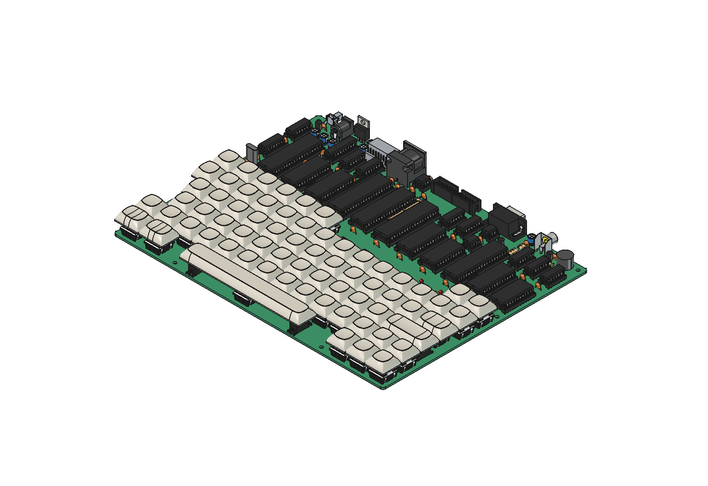
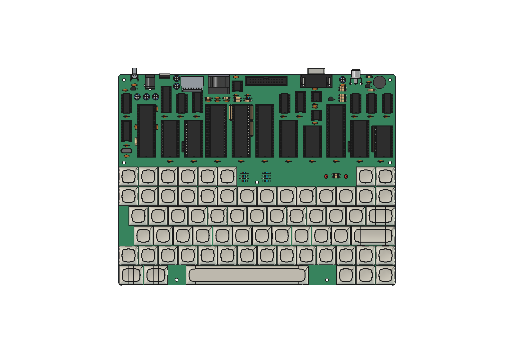

# radio-86rk-case

A 3D model of the [Radio-86RK](https://github.com/BarabashkaD/radio-86rk) as an
assembled machine — the populated board, its 67 keyswitches, the keycaps on top
of them, and the envelope the enclosure will be designed against.



*The whole machine, built from tracked files in under a second. 251 components,
721 solids, 67 keycaps including the 6.25u spacebar.*

## What this repository is for

The board itself lives in a separate repository and is **read-only from here**.
This one adds everything above the PCB:

| | |
|---|---|
| **The assembled model** | `model/radio86rk-assembly.FCStd` — open it in FreeCAD and you see the machine. No build step, no scripts. |
| **The enclosure interface** | `model/envelope.step` — 67 prisms, one per key, sized to the tallest cap. Everything a case needs *for the keyboard field*; see below for what it does not carry. |
| **The keycaps** | Placed on their switches to a measured seat height, not an estimated one. |
| **A gate that checks all of it** | Eleven checks, from "does the board still have 67 switches" to "do the caps sit where they should". |



## Just looking at it

Open `model/radio86rk-assembly.FCStd` in FreeCAD 1.1.1. That is the whole
instruction. The project is tracked complete — board, components, switches and
caps — so nothing needs building or generating first.

You will get the view above. Both the camera and the visibility state are saved
in the file: construction geometry is hidden, so no grey datum planes obscure
the model, and the stored camera is the isometric the render was shot from.

## Building and checking

Everything runs under FreeCAD's console binary, which is **not on `PATH`**:

    FC=/Applications/FreeCAD.app/Contents/Resources/bin/freecadcmd

    $FC tools/build_caps.py    # place the caps, write model/envelope.step   ~1 s
    $FC tools/verify.py        # the gate: 11 checks                        ~24 s

**In that order.** Four of the eleven checks read what `build_caps.py` writes,
so running the gate on a fresh clone reports `INCOMPLETE` and exit 2 — not
because anything is wrong, but because there is nothing yet to check. Build
first.

Exit codes: `0` pass, `1` a real finding, `2` could not run — never a verdict.
Both always print a `verdict:` line, so you can parse for it. Run one check with
`$FC tools/verify.py C`, or all with no argument.

`build_caps.py` writes `model/envelope.step`, which is tracked. STEP stamps a
timestamp into its header, so `git status` will report it modified after a
rebuild that changed no geometry at all. That is expected — don't commit it
unless the geometry really moved, and `$FC tools/verify.py C D` will tell you
whether it did.

## Designing a case against the envelope

`model/envelope.step` is a compound of exactly **67 rectangular prisms and
nothing else** — 402 planar faces, no board, no fasteners, no annotation. It is
the volume the keys sweep, and it is deliberately that and only that.

It is in **the board's coordinate frame**, which the STEP file itself cannot
tell you, so it is written here:

| | |
|---|---|
| Extent | X `6.675 … 272.725`, Y `−209.225 … −95.575` (266.050 × 113.650 mm) |
| Z | `10.743` (cap base) to `22.743` (cap top), uniform across all 67 |
| Key gap | 0.65 mm — each prism is that much narrower than the 19.05 mm pitch, so neighbours never touch |
| Origin | the board's, shared with `model/radio86rk-assembly.FCStd`. Load both and they line up with no transform |

**What you can design from this file alone**, confirmed by building a plate with
a keyboard cutout against it: the opening outline, the height the case must
clear, the per-key bezel if you want one, and the clearance between keys.

**What it does not carry, and where to get it:** the board outline, mounting
holes, and connector positions are not in here and cannot be derived from it.
Those come from the board — either `model/radio86rk-assembly.FCStd`, which is
in the same frame, or the KiCad project in the `radio-86rk` repository.

One thing is not encoded at all: **key travel**. The Z range is the static
worst case with the caps at rest, not the stroke. If a design needs to clear a
pressed key, that number is a Cherry MX specification, not something this
repository measures.

## Changing the keycaps

The rendered caps and the caps you buy need not match. The envelope is sized
for a sculpted Cherry/OEM profile, so a blank DSA/XDA set or a printed Cyrillic
set will both fit under it.

Swapping the *rendered* profile takes four steps today:

1. Put the new STEP files in `vendor/<profile>/`, one per key size.
2. Point `keycaps.tsv`'s `model_file` column at them — one row per size:
   1u, 1.25u, 1.5u, 2.25u and the 6.25u spacebar.
3. Re-derive the seat height, because a different profile has its stem socket
   at a different depth:

       $FC tools/measure.py seat

   Copy the `seat_dz` it prints into `params.tsv`.
4. Rebuild and check: `$FC tools/build_caps.py && $FC tools/verify.py`

Step 3 is the one that catches people out, and it is why this is four steps
rather than one. See "Known limits" below.

If step 2 points a row at a cap of the wrong width, `build_caps.py` warns and
builds anyway, and the gate refuses it — check B names both widths and the
likely mistake. The build does not adjudicate; the gate does.

## When the board changes

Only then do you need the GUI. KiCadStepUp cannot load under the console
binary, so re-importing the board runs inside a FreeCAD window driven by the
[FreeCAD MCP bridge](https://github.com/blwfish/freecad-mcp):

```python
import sys
sys.path.insert(0, "/path/to/radio-86rk-case")
import tools.import_board as import_board
import_board.rebuild("/path/to/radio-86rk/KiCad/Radio-86RK.kicad_pcb")
```

That takes about 40 s and rewrites `model/placements.json`,
`model/import_log.txt` and `model/radio86rk-assembly.FCStd`. Then rebuild and check
as above.

The `sys.path` line is not boilerplate: a GUI instance does not start in this
repository, and observed working directories have included two unrelated repos.
Set it explicitly rather than reasoning about where it landed.

**After any GUI session, run `git status`.** Closing a FreeCAD window rewrites
the tracked `model/radio86rk-assembly.FCStd` with nothing having called
`save()`. The size of the change varies — 6,289 bytes and 1,594 bytes have both
been observed — so do not go looking for a particular number. Any unexplained
diff on that file is this. `.gitignore` covers the harmless `.FCBak`
that appears beside it and does *not* cover the `.FCStd`. Revert any `.FCStd`
diff you cannot explain. `tools/render.py` closes its document explicitly for
this reason; do the same in any new GUI code.

## Re-shooting the renders

The two images in this README are the visual sign-off record — the one check
the gate cannot run on itself. They need a GUI, because FreeCAD cannot save a
viewport image without one:

```python
import sys
sys.path.insert(0, "/path/to/radio-86rk-case")
import tools.render as render
render.render_all()
```

Both views, 1600×1100, document closed without saving. Keep the resolution —
these files exist to be compared against their predecessors.

## What is tracked, and why

One question decides it: **can this be regenerated headlessly?** If not, it is
tracked, because a checkout without it cannot do most of what this repo is for.

| File | Size | Why |
|---|---|---|
| `model/radio86rk-assembly.FCStd` | 5.6 MB | The assembled model. Recreating it needs a GUI, the KiCadStepUp addon, KiCad's model libraries and the right preferences all lined up; this file survives any of those changing |
| `model/envelope.step` | 397 KB | The enclosure interface — the keyboard field, in board coordinates. A consumer should not have to run FreeCAD to get it |
| `model/placements.json` | 11 KB | Where all 67 switches are. Without it, five checks cannot run |
| `model/import_log.txt` | 154 KB | The import's own record. It is per-process and dies with the FreeCAD instance — unreconstructable afterwards |
| `model/reference-placement.csv` | 11 KB | An independent reading of the board's switch positions, frozen at board revision `4f4c1b5` |
| `model/reference-caps.tsv` | 3 KB | An independent reading of where the caps land, frozen at the same revision. Two checks compare this build against these two files |
| `model/renders/computer-*.png` | 350 KB | The visual sign-off record, 1600×1100. They show the whole machine |

Not tracked, in `.build/` — regenerated in about a second:
`caps/caps.step`, 8.3 MB of placed caps derived entirely from `model/` plus
the vendored profiles.

## Requirements

Every row is checkable by copying the command. Nothing here is on `PATH` — this
is macOS, and both applications bury their binaries inside the bundle.

| What | Want | Run this |
|---|---|---|
| FreeCAD | 1.1.1 | `/Applications/FreeCAD.app/Contents/Resources/bin/freecadcmd --version` |
| KiCadStepUp | 13.1.7 | `grep -E '^___ver___' "$HOME/Library/Application Support/FreeCAD/v1-1/Mod/kicadStepUpMod/kicadStepUptools.py"` |
| FreeCAD MCP bridge | any | `ls ~/.freecad-mcp/freecad_mcp_server.py` — source: [github.com/blwfish/freecad-mcp](https://github.com/blwfish/freecad-mcp) |
| `radio-86rk` checkout | **`4f4c1b5`** | `git -C ../radio-86rk rev-parse --short=7 HEAD` |

The board revision is pinned. One check enforces it, because every tracked file
in `model/` was derived from that revision and silently mixing revisions is the
failure this project most wants to avoid.

**Only the FreeCAD MCP bridge is needed for the GUI steps**, and only when the
board changes or you re-shoot the renders. Building the caps, the envelope and
running the gate need nothing but FreeCAD and a board checkout.

**The KiCadStepUp version is not where you would look for it.** The addon
carries two version markers that disagree: `package.xml` reports `11.09.6`
while `kicadStepUptools.py`'s `___ver___` reports `13.1.7`. The number above is
the second one. Checking the first and concluding your install is broken is a
wasted afternoon.

Two paths are discovered rather than hard-coded, and either can be overridden:
`RADIO86RK_BOARD` (default: the `radio-86rk` checkout beside this one) and
`KSU_MOD` (default: the KiCadStepUp addon in FreeCAD's user directory).

**macOS only, today.** See "Known limits" below.

## Known limits

Written down rather than implied. None of these blocks using the repository as
it stands.

**Swapping caps takes four steps and should take one.** The awkward step is not
busywork: a different profile has its stem socket at a different depth, so the
seat height genuinely has to be re-measured or every cap floats or sinks.
Copying that number by hand is what makes it four steps. A `swap_caps.py` that
measured and wrote `params.tsv` itself would close it — but note that the gate
re-derives `seat_dz` independently on purpose, so a tool writing both the value
and its check would turn that check into a tautology. `params.tsv` also records
*how* each value was derived, and that column must survive.

**macOS only, today.** The FreeCAD binary path and the addon directory are
macOS-shaped, in this file and as defaults in `tools/`. `KSU_MOD` already
overrides the addon path, so that half is solvable by documentation; the
FreeCAD path is hard-coded in every documented command. The honest first step
is stating which paths are platform-specific and giving the Linux and Windows
equivalents — claiming support without a machine to test it on is the kind of
unverified assertion this repository has been bitten by before.

**The frozen references cannot currently be regenerated.** `model/reference-*`
were produced by a second, independent pipeline that has since been removed.
They are recoverable from git history, but nothing in the working tree can
rebuild them. This bites the day the board revision moves: the pinning check
fails first and loudly, and the fix is then either to recover that pipeline or
to retire both cross-checks deliberately — which would drop the gate from
eleven checks to nine and lose the only cross-validation of where the caps
physically land.

**Nothing consumes the envelope yet.** `model/envelope.step` is the interface,
and the enclosure it exists for has not been designed. That is the actual next
piece of work; everything above is housekeeping in front of it. A cold audit
built a trial plate against the envelope and it worked, so the interface is
known to be usable -- but only for the keyboard field. See "Designing a case
against the envelope".

## Provenance and licensing

**This work is GPL-3.0** — see [LICENSE](LICENSE) — matching the Radio-86RK
board repository it reads, so derivative case designs stay open.

**One exception, stated plainly: the vendored keycap models are not covered by
that, and their licence is unknown.** `vendor/dsa/` holds five STEP solids
exported in March 2017 whose headers carry an empty author and an empty
organization; "DSA Keycap Project" is a directory name on someone's drive, not
an attribution. See [vendor/dsa/PROVENANCE.md](vendor/dsa/PROVENANCE.md) for
exactly what the files say about themselves.

This matters beyond `vendor/`: their geometry is baked into
`model/radio86rk-assembly.FCStd` and their measured height sets
`model/envelope.step`, so removing the source files would not remove the
derivatives. If you are a rights holder and object, open an issue — swapping
the profile is one column of `keycaps.tsv` plus a rebuild, and the repository
is built so that is cheap.

The board repository is read-only from here. This project never commits to it,
and one check enforces that.
